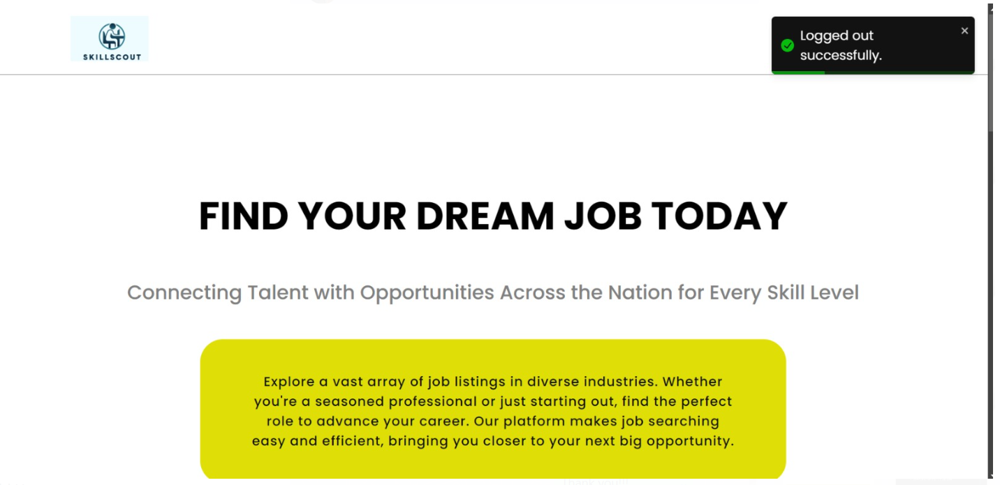
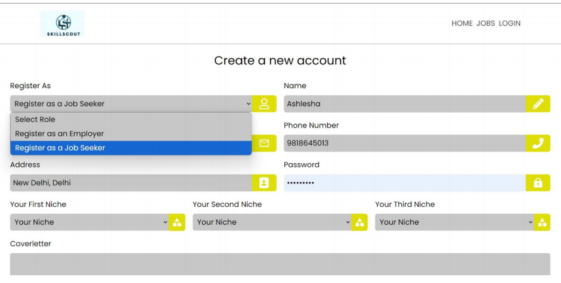
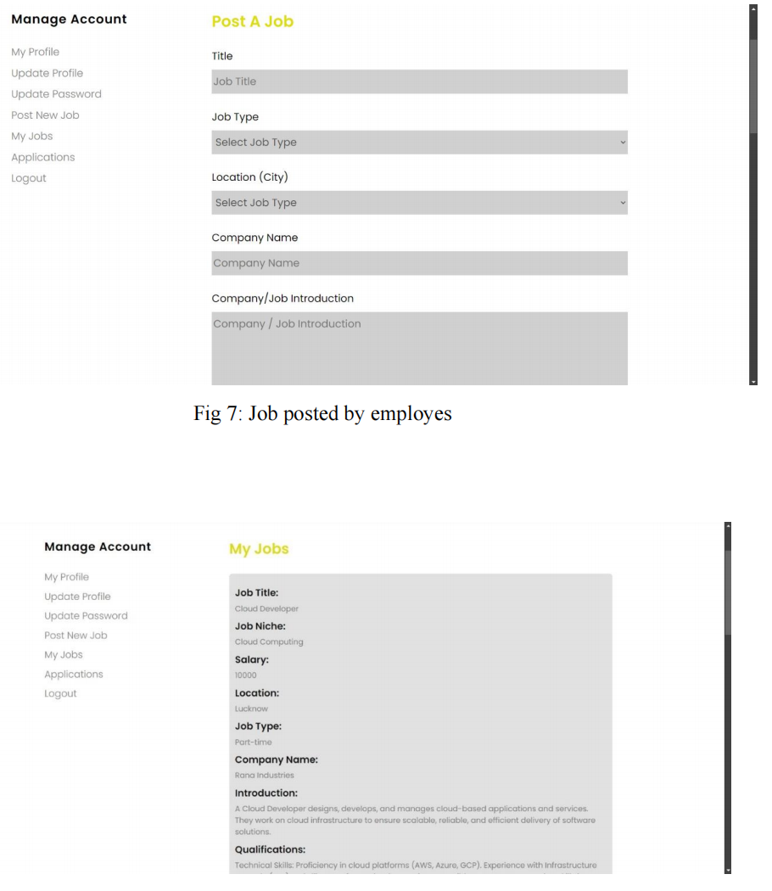
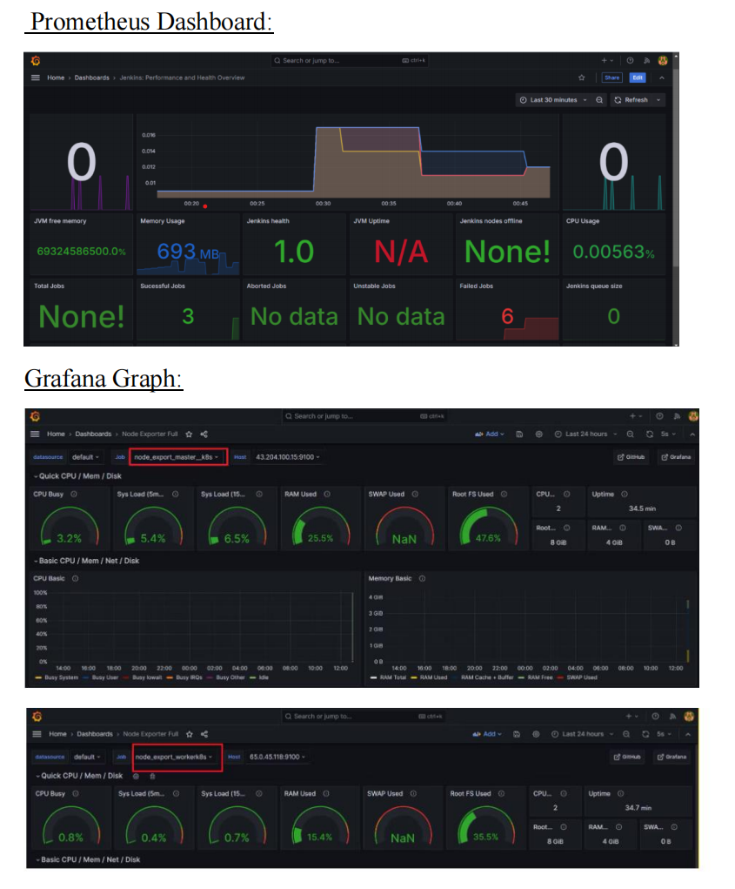

# SkillScout: Job Portal with Complete DevOps Cycle

SkillScout is a modern job portal designed for seamless interaction between job seekers and employers. Built with the MERN stack and integrated with a comprehensive DevOps lifecycle, SkillScout ensures scalability, reliability, and a secure user experience.

---

## Features

- **For Job Seekers**:
  - Advanced job search and matching algorithms.
  - Real-time notifications and application tracking.
  - User-friendly registration and profile management.

- **For Employers**:
  - Job posting and candidate management.
  - Real-time application updates.
  - Insights through job analytics dashboards.

- **DevOps Integration**:
  - Continuous integration and deployment using Jenkins.
  - Real-time monitoring with Prometheus and Grafana.
  - Secure containerization and image scanning with Docker and Trivy.

---

## Tech Stack

- **Frontend**: React.js
- **Backend**: Node.js, Express.js
- **Database**: MongoDB
- **DevOps Tools**: Jenkins, Docker, Kubernetes, Terraform, SonarQube, Trivy
- **Cloud Infrastructure**: AWS (EC2, S3)
- **Monitoring**: Prometheus, Grafana

---

## Getting Started

### Prerequisites

- Node.js and npm
- Docker and Docker Compose
- AWS account for deployment

### Installation

1. Clone the repository:
   ```bash
   git clone https://github.com/MadeshiAshlesha/SkillScout.git
   cd SkillScout
   ```
2. Install dependencies for frontend and backend:
   ```bash
   cd client
   npm install
   cd ../server
   npm install
   ```
3. Run the application locally:
   ```bash
   docker-compose up
   ```

---

## Screenshots

### Homepage


### Job Seeker Registration


### Employer Dashboard


### Application Monitoring


---

## Authors

- Madeshi Ashlesha ([GitHub](https://github.com/MadeshiAshlesha))
- Aparna Rana
- Prakriti Singh
- Rudransh Singh

---


